<p align="center">
  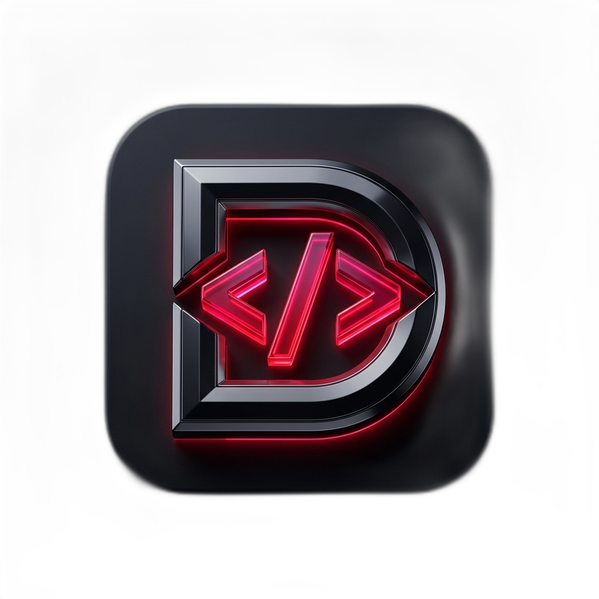
</p>

<h1 align="center">DevType</h1>

<p align="center">
  <strong>Native macOS Text Expander & On-Device AI Writing Assistant</strong>
</p>

<p align="center">
  <a href="https://github.com/bharathvbcr/DevType/actions/workflows/ci.yml"></a>
  
  
  
  
  <a href="LICENSE"></a>
  <!-- ALL-CONTRIBUTORS-BADGE:START - Do not remove or modify this section -->
  <a href="#-contributors"></a>
  <!-- ALL-CONTRIBUTORS-BADGE:END -->
</p>

---

<p align="center">
  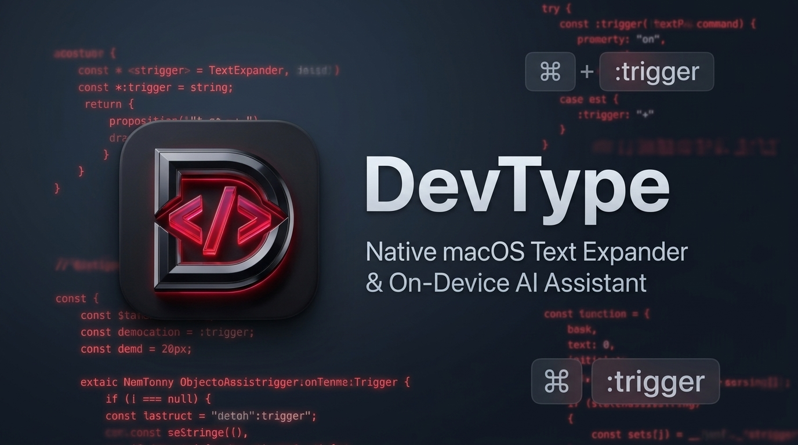
</p>

**DevType** is a fast, lightweight, native macOS text expander and snippet manager built with Swift and AppKit. Equipped with on-device AI text transformations powered by Apple Foundation Models, DevType offers sub-millisecond keyword expansion and offline writing tools with zero cloud telemetry.

It expands typed triggers in place, renders Mustache and TextExpander macros, runs local AI proofreading and rewriting, and keeps passwords in an encrypted, Touch ID-gated store. Existing TextExpander and Espanso libraries import directly.

---

## 📑 Table of Contents

- [📸 Screenshots](#-screenshots)
- [✨ Key Features](#-key-features)
- [⌨️ Keyboard Shortcuts](#️-keyboard-shortcuts)
- [🚀 Quick Start & Installation](#-quick-start--installation)
- [📚 Documentation Suite](#-documentation-suite)
- [🤖 On-Device AI Transforms](#-on-device-ai-transforms-macos-26)
- [🎙️ Smart Dictation](#️-smart-dictation)
- [🔒 Secret Snippets (Touch ID)](#-secret-snippets-passwords)
- [🧩 Template & Macro Engine](#-template-engine-reference)
- [🤝 Open Source & Contributing](#-open-source--contributing)
- [❓ Frequently Asked Questions (FAQ)](#-frequently-asked-questions-faq)
- [📄 License & Attribution](#-license--attribution)

---

## 📸 Screenshots

<p align="center">
  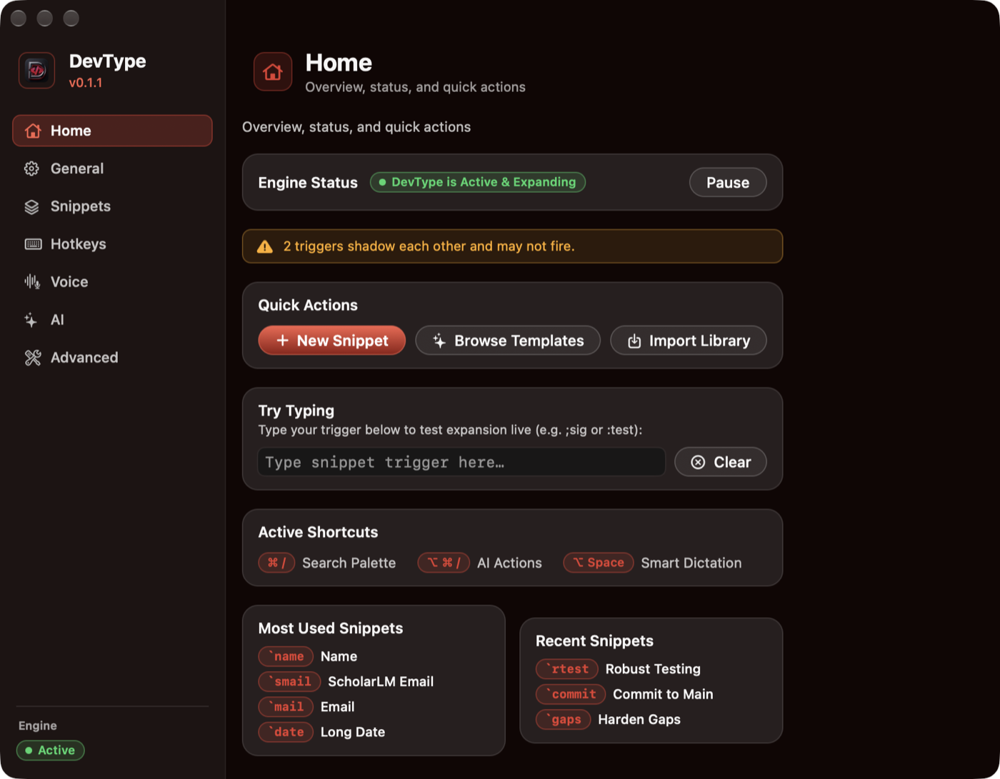
</p>

<table>
  <tr>
    <td width="50%" align="center">
      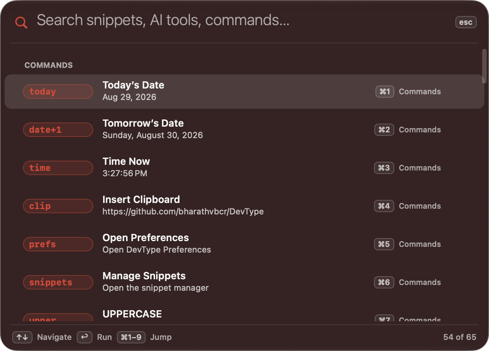<br>
      <sub><b>Command palette (<code>⌘/</code>)</b> — snippets, AI tools, math, dates, and text operations in one search field.</sub>
    </td>
    <td width="50%" align="center">
      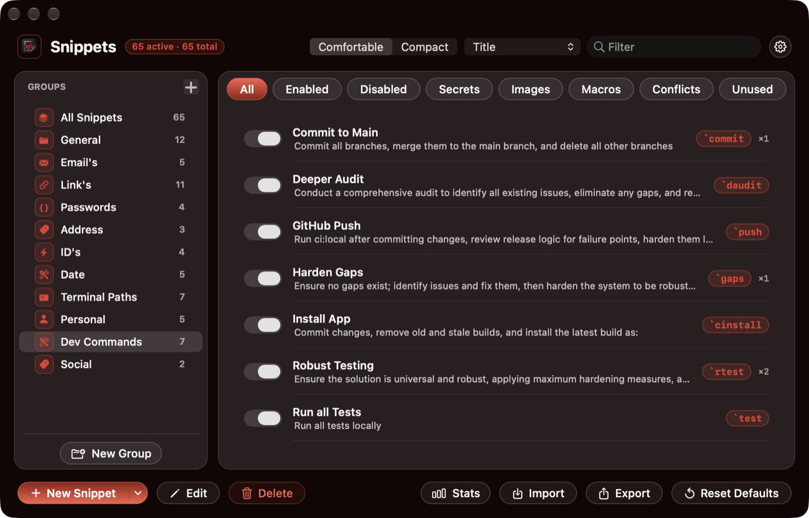<br>
      <sub><b>Snippet library</b> — groups, filters, and per-snippet usage counts.</sub>
    </td>
  </tr>
  <tr>
    <td width="50%" align="center">
      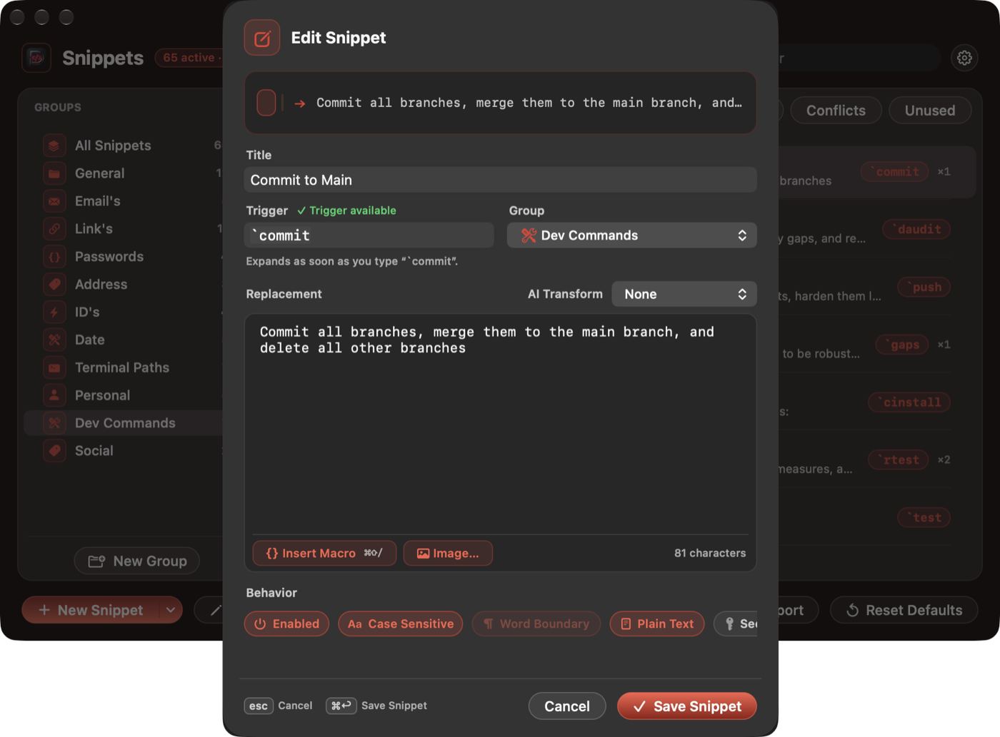<br>
      <sub><b>Snippet editor</b> — live trigger validation, macro insertion, and per-snippet behaviour.</sub>
    </td>
    <td width="50%" align="center">
      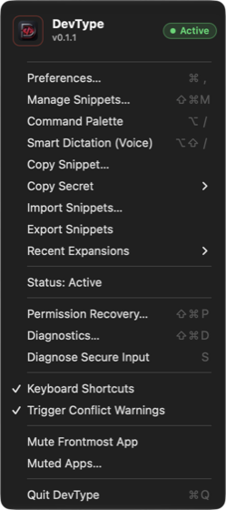<br>
      <sub><b>Menu bar</b> — status, secrets, recent expansions, and permission recovery.</sub>
    </td>
  </tr>
</table>

---

## ✨ Key Features

- ⚡ **Instant Expand-on-Match**: Low-latency swallowing ring buffer that instantly replaces typed triggers using Accessibility range replacement (with fallback to HID clipboard paste).
- 🎙️ **Smart Dictation**: Push-to-talk speech-to-text with thought-revision / self-correction resolution, filler stripping, and custom vocabulary (inspired by [Google Gemini Jot](https://github.com/google-gemini/jot-gemini-transcribe-macOS)). Pick the recognizer in **Preferences → Voice**: Apple Speech, an on-device local model, or a local `whisper.cpp` server — all offline. A cloud engine is available but stays off unless you supply your own API key. See [docs/VOICE_DICTATION.md](docs/VOICE_DICTATION.md).
- 🤖 **On-Device AI Transforms**: Built-in AI text actions (proofread, rewrite, paraphrase, expand, condense, tone shift, bulletize, prompt enhance, code explain/fix/test, git commit message, translate, convert to Markdown) using Apple Foundation Models (macOS 26+), plus a first-class offline **Remove Markdown** action running locally without an AI model on all supported macOS versions (macOS 14+). 100% private, zero API keys required.
- 🔍 **Hybrid Command Palette** (`⌘/`): Lightning-fast fuzzy and conversational search for snippets and AI tools, optional on-device semantic routing, inline math (`= 45 * 12.5`), custom one-shot AI prompts (`> …`), date offsets (`tomorrow`, `+3w`, `next friday`), instant text operations (case, sort, dedupe, Base64/URL/JSON, SHA-256/MD5), generators (UUID, lorem, password), and quick app navigation — ranked by your own usage.
- 🧩 **Dual Macro Engine**: Full support for both Mustache (`{{date:iso:+1d}}`, `{{clipboard}}`, `{{calc: 1+2}}`, `{{uuid}}`, `{{cursor}}`) and TextExpander (`%filltext:name=X%`, `%@+1D%`, `%snippet:x%`, `%|`, `%key:enter%`) template syntaxes.
- 🖼️ **Rich Image Snippets**: Paste images directly from snippet triggers with full Espanso `image_path` import support.
- 📦 **One-Click Importers**: Seamlessly import existing snippet libraries from TextExpander settings bundles (`.textexpandersettings` / `.textexpanderbackup`) and Espanso YAML match configs — with export to Espanso YAML, an atomic Espanso `match/` folder, CSV, or DevType JSON.
- 🛡️ **Privacy & Fail-Closed Security**: Automatic expansion pause during password entry (`NSSecureTextField`), Secure Event Input locks, IME composition, or in muted apps.
- 🔒 **Secret Snippets**: Store passwords AES-GCM-encrypted, gated behind Touch ID, copied from the menu bar with an auto-clearing concealed clipboard — never in the library file, exports, or diagnostics. See [SECRETS.md](SECRETS.md).
- 🔑 **Stable Identity TCC**: Packaged `.app` bundle with dedicated code identity (`com.devtype.app`) so macOS Accessibility & Input Monitoring permissions persist cleanly across updates.
- 🔔 **Opt-In Update Checks**: DevType can tell you when a new release ships — **off by default**, at most once a day, and it never downloads or installs anything on its own. The request carries no version, machine, or usage data; you get a notice with the release notes and a button to the release page. "Check for Updates…" in the menu bar and Preferences always works regardless of the setting.

---

## ⌨️ Keyboard Shortcuts

| Shortcut | Action | Description |
|---|---|---|
| **`⌘/`** | **Command Palette** | Global fuzzy search across all snippets, math evaluation, date tools, and text utilities |
| **`⌘⌥A`** | **AI Action Palette** | Highlight text and trigger on-device AI transforms, code tools, translations, or custom prompts |
| **`⌘⌥V`** | **Smart Dictation** | Push-to-talk or hands-free voice dictation with the recognizer you pick in Preferences → Voice |
| **`⌘⇧M`** | **Snippet Manager** | Open the full snippet library and editor window |
| **`⌘,`** | **Preferences** | Open the 7-tab Preferences window (Home, General, Snippets, Hotkeys, Voice, AI, Advanced) |
| **`:trigger`** | **Typed Expansion** | Type any snippet abbreviation to instantly expand the template in place |
| **`⌘⇧P`** | **Permission Recovery** | Open the status/diagnostics window to fix Accessibility & Input Monitoring grants |
| **`Esc`** | **Dismiss / Cancel** | Close active panels, search palettes, or AI previews |

Every global shortcut is rebindable in **Preferences → Hotkeys**, which is also where you bind a key straight to a block of text or a URL.

<p align="center">
  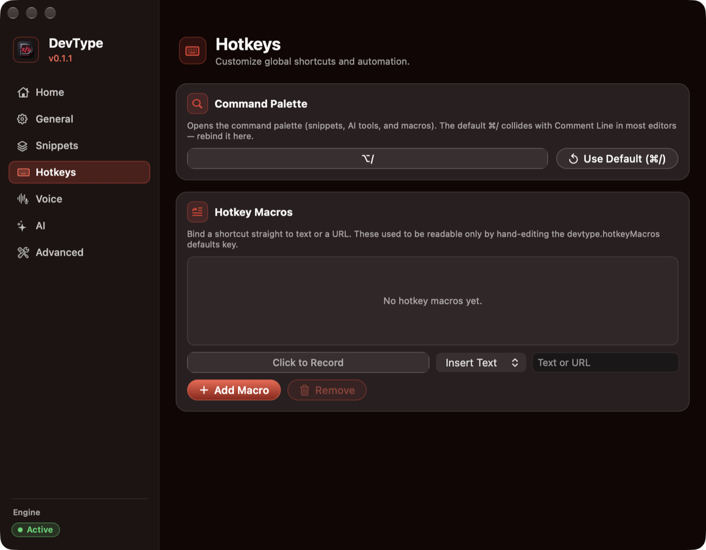
</p>

---

## 🚀 Quick Start & Installation

### Option 1: Download Pre-built Release
Download the latest macOS disk image (`.dmg`) directly from the [DevType GitHub Releases Page](https://github.com/bharathvbcr/DevType/releases/latest).

1. Open the downloaded `.dmg`.
2. Drag **DevType.app** to your `/Applications` folder.
3. Open DevType and follow the Permissions Setup Wizard.

### Option 2: Building from Source

```bash
# 1. Clone the repository
git clone https://github.com/bharathvbcr/DevType.git
cd DevType

# 2. Sign with a stable identity so TCC grants survive rebuilds.
#    If Xcode has an Apple Development certificate (a free Apple ID is enough),
#    the build picks it up automatically and this step is unnecessary.
#    Otherwise, create the self-signed fallback:
./Scripts/make-signing-cert.sh

# 3. Build and package the application bundle (.build/DevType.app)
./Scripts/package-app.sh release

# 4. Install to /Applications
./Scripts/install-app.sh
open /Applications/DevType.app
```

---

## 📚 Documentation Suite

Explore our complete documentation in the [`docs/`](docs/) directory:

- 📖 **[User Guide](docs/USER_GUIDE.md)**: End-user manual for creating snippets, organizing groups, fill-in forms, Smart Dictation, and preferences.
- 🏛️ **[Technical Architecture](docs/ARCHITECTURE.md)**: Deep dive into event taps, text injection pipelines, threading models, and exception safety.
- 🧩 **[Macro Syntax Reference](docs/MACRO_REFERENCE.md)**: Exhaustive reference cheat sheet for Mustache, TextExpander, math, and date tokens.
- 🔐 **[Permissions & TCC Guide](docs/PERMISSIONS_GUIDE.md)**: Setting up and troubleshooting macOS Accessibility and Input Monitoring permissions.
- 🛠️ **[Developer Guide](docs/DEVELOPMENT.md)**: Build tooling, running 1,900+ headless unit tests, debugging, and release automation.
- 📦 **[Release notes](docs/releases/v0.1.3.md)**: Current v0.1.3 changes, verification status, and release safeguards.
- 🔒 **[Secret Snippets Design](SECRETS.md)**: Cryptographic threat model, AES-GCM encryption, and Touch ID biometric gating.

---

## 🤖 On-Device AI Transforms (macOS 26+)

Run Apple Foundation Models text transformations on-device with zero cloud telemetry, plus offline local Markdown tools that run on all macOS versions (macOS 14+).

<p align="center">
  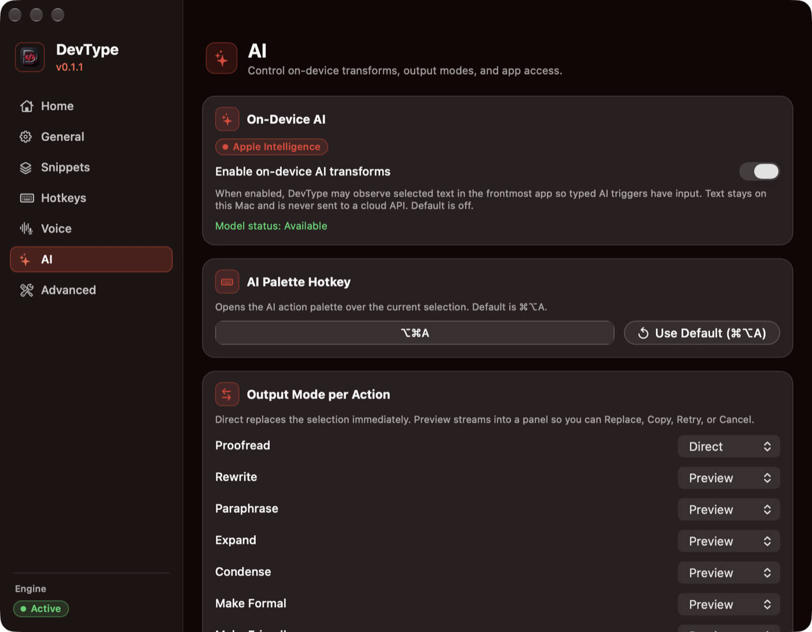
</p>

- **Enable**: Go to **Preferences → AI** and turn on `Enable on-device AI transforms`.
- **Action Palette** (`⌘⌥A`): Highlight text in any application and press `⌘⌥A` to bring up the AI action menu.
- **Typed Triggers**: Assign AI actions directly to triggers (e.g. typing `:fix` or `:rw` over selected text automatically replaces or previews the transformed text).
- **Available Actions**: Proofread (direct replace), Rewrite, Paraphrase, Expand, Condense, Tone Shift (Formal/Friendly), Bulletize, Prompt Enhance, Code tools (Explain Code, Docstring, Fix Code, Unit Tests, Regex Explain, SQL Query), Git Commit Message, JSON conversion, Translation (English ⇄ romanized Telugu/Hindi), Convert to Markdown, and Freeform Prompting (`> custom prompt` from the Command Palette).
- **Offline Local Transform**: **Remove Markdown** strips Markdown formatting and leaves clean prose locally on all supported macOS versions (macOS 14+) without an AI model.
- **Preview or Direct**: Proofread and Remove Markdown replace in place by default; every other action streams into a diff preview (Replace / Copy / Retry / Cancel). Per-action delivery is switchable in **Preferences → AI**, and **Undo last AI** in the palette reverts a transform.

---

## 🎙️ Smart Dictation

Hold `⌘⌥V` to talk and DevType types what you said into the frontmost app, resolving self-corrections ("no wait, make that Tuesday") and stripping fillers along the way.

- **Choose your recognizer** in **Preferences → Voice**: Apple Speech, an on-device local model, or a local `whisper.cpp` server. Each engine reports its own readiness so you know what is actually installed.
- **Cloud is opt-in**: the cloud engine is inert until you add your own API key, and it is never the default.
- **Custom vocabulary** teaches DevType the names, products, and jargon that generic recognizers get wrong.

Full detail in [docs/VOICE_DICTATION.md](docs/VOICE_DICTATION.md).

<p align="center">
  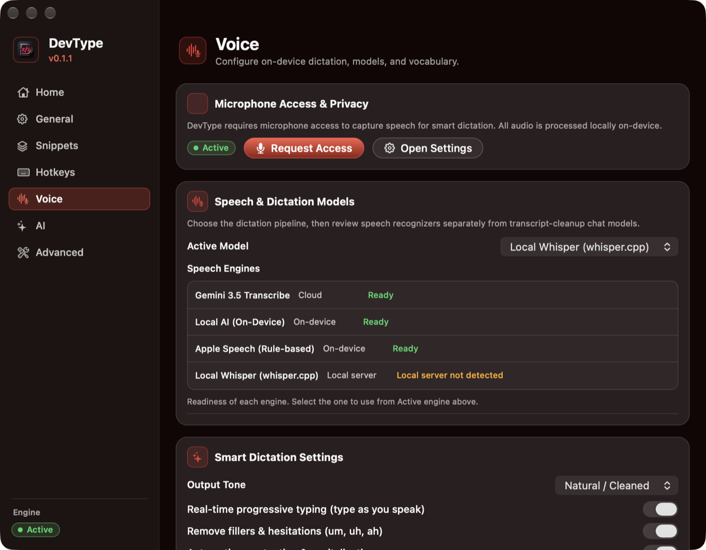
</p>

---

## 🔒 Secret Snippets (Passwords)

<p align="center">
  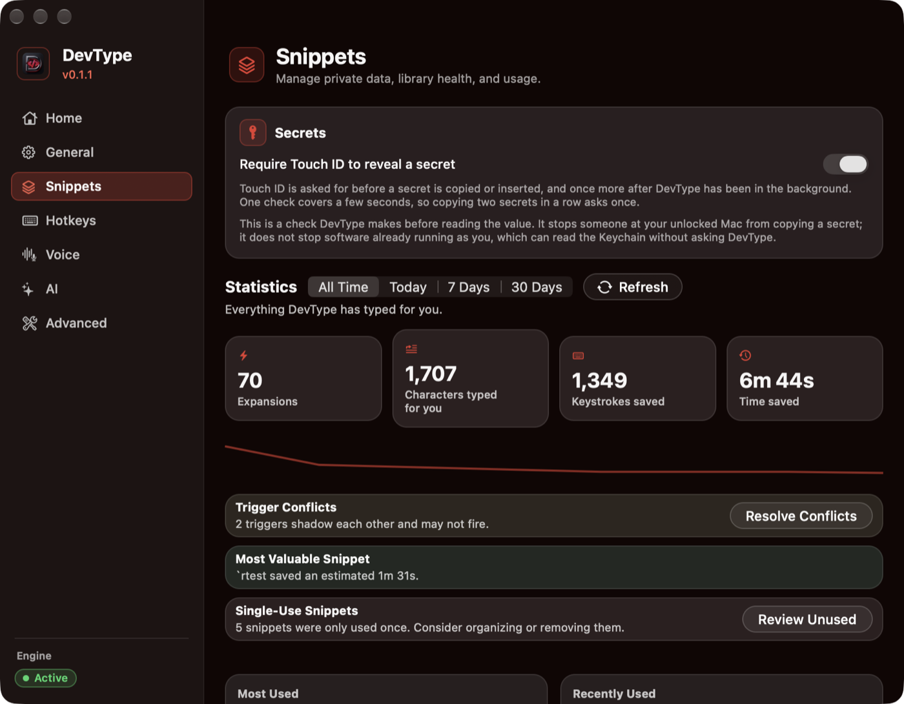
</p>

Mark any snippet **Secret** in the editor and its value moves out of the snippet library entirely — AES-GCM-sealed in an encrypted archive, with a single master key in the login keychain, gated behind **Touch ID**.

- **Copy, don't type**: secrets never expand from typed triggers — macOS Secure Event Input withholds keystrokes in password fields, and a typo firing a password into a chat window is avoided by design. Use **menu bar → Copy Secret ▸** or **Search Secrets…**, then paste with `⌘V`.
- **Touch ID first**: each copy asks for Touch ID (password fallback available, one 30-second reuse window).
- **Auto-clearing clipboard**: copies are marked concealed (clipboard managers ignore them) and cleared after 90 seconds.
- **Zero leaks by construction**: values are absent from `snippets.json`, every export, the editor after save, and diagnostic reports.

---

## 🧩 Template Engine Reference

DevType parses Mustache `{{...}}` tags and TextExpander `%...%` tags seamlessly.

### Mustache (`{{...}}`)
| Tag | Description |
|---|---|
| `{{date}}` / `{{date:yyyy-MM-dd}}` | Insert current date (standard patterns or named presets like `us`, `iso`, `eu`) |
| `{{date:iso:+1d}}` / `{{date:+1w}}` | Date arithmetic — offset a preset or pattern by `y/M/w/d/h/m/s` units |
| `{{time}}` | Insert current time |
| `{{clipboard}}` | Insert current pasteboard text (read on-demand only) |
| `{{calc: 1+2}}` | Perform safe inline arithmetic evaluation |
| `{{cursor}}` | Position the caret after snippet expansion |
| `{{snippet:trigger_name}}` | Nest another snippet recursively (max depth 10) |
| `{{uuid}}` | Generate an upper-case UUID (lower-case via `{{uuid:lower}}`) |
| `{{random:1-100}}` | Random value — integer range, `a\|b\|c` choices, or `hex:`/`alnum:`/`digits:`/`letters:` specs |
| `{{counter:name}}` | Persistent named counter (optional step, e.g. `{{counter:ticket:+5}}`) |
| `{{upper:text}}` … `{{sentence:text}}` | Case transforms — also work around nested tags and fill-ins |

### TextExpander (`%...%`)
| Tag | Description |
|---|---|
| `%filltext:name=Field%` | Display interactive fill-in dialog before expanding (also `%fillarea%`, `%fillpopup%`, optional `%fillpart%…%fillpartend%` sections) |
| `%date:FORMAT%` | Format date with `DateFormatter` pattern or preset (`%date:us%`, `%date:full%`) |
| `%@+1D%` | TextExpander-style date math (`y M w d h m s` units) |
| `%clipboard` | Insert pasteboard text |
| `%|` | Position caret marker |
| `%snippet:abbrev%` | Nest another snippet |
| `%key:enter%` / `%key:tab%` | Post trailing keystroke after injection (also `return`, `esc`, `space`) |
| `%uuid%`, `%random:1-100%`, `%counter:name%` | Generated values |
| `%case:upper% … %caseend%` | Case-transform the enclosed block |

Inside a macro body, `%%` is an escaped literal `%`. Unknown `%…%` sequences (like URL-encoded text) are left untouched.

See the full [Macro Reference](docs/MACRO_REFERENCE.md) for more examples.

---

## 🤝 Open Source & Contributing

We welcome contributions from the open source community!

- 💻 **[Contributing Guide](CONTRIBUTING.md)**: How to set up your environment, coding standards, and submit pull requests.
- 📜 **[Code of Conduct](CODE_OF_CONDUCT.md)**: Community standards and guidelines.
- 🛡️ **[Security Policy](SECURITY.md)**: Vulnerability reporting and security principles.
- 💬 **[Support & Help](SUPPORT.md)**: Getting help, asking questions, and reporting bugs.
- 🐛 **[Issue Tracker](https://github.com/bharathvbcr/DevType/issues)**: Report bugs or request features.

New here? Issues labelled **[`good first issue`](https://github.com/bharathvbcr/DevType/issues?q=is%3Aissue+is%3Aopen+label%3A%22good+first+issue%22)** are scoped to be self-contained, and **[`help wanted`](https://github.com/bharathvbcr/DevType/issues?q=is%3Aissue+is%3Aopen+label%3A%22help+wanted%22)** marks work that is ready for someone to pick up.

### ✨ Contributors

Thanks goes to these wonderful people ([emoji key](https://allcontributors.org/docs/en/emoji-key)) — code, design, docs, and bug reports all count:

<!-- ALL-CONTRIBUTORS-LIST:START - Do not remove or modify this section -->
<!-- prettier-ignore-start -->
<!-- markdownlint-disable -->
<table>
  <tbody>
    <tr>
      <td align="center" valign="top" width="14.28%"><a href="https://github.com/bharathvbcr"><br /><sub><b>Bharath Chandra Vaddaram</b></sub></a><br /><a href="#code-bharathvbcr" title="Code">💻</a> <a href="#doc-bharathvbcr" title="Documentation">📖</a> <a href="#design-bharathvbcr" title="Design">🎨</a> <a href="#maintenance-bharathvbcr" title="Maintenance">🚧</a> <a href="#security-bharathvbcr" title="Security">🛡️</a> <a href="#test-bharathvbcr" title="Tests">⚠️</a> <a href="#infra-bharathvbcr" title="Infrastructure">🚇</a></td>
    </tr>
  </tbody>
</table>

<!-- markdownlint-restore -->
<!-- prettier-ignore-end -->

<!-- ALL-CONTRIBUTORS-LIST:END -->

This list is maintained by the [All Contributors](https://allcontributors.org/) bot. To add someone, comment on any issue or PR:

```
@all-contributors please add @username for code, doc
```

---

## ❓ Frequently Asked Questions (FAQ)

### Is DevType free and open source?
Yes! DevType is completely free and open-source under the MIT License.

### Does DevType collect or send my keystrokes to the cloud?
No. Keystrokes are processed locally in a volatile memory ring buffer solely for matching triggers, and they never leave your Mac. Expansion and AI transforms make no network requests — AI runs on Apple Foundation Models on-device. The only two features that can reach the network are the opt-in update check (off by default, and it sends no version, machine, or usage data) and the cloud dictation engine, which is inert unless you add your own API key.

### Can I import my existing snippets from TextExpander or Espanso?
Yes. DevType includes built-in importers for TextExpander settings bundles (`.textexpandersettings` / `.textexpanderbackup`) and Espanso YAML config folders or match files, preserving your triggers, replacements, and image attachments. Libraries can be exported back out as DevType JSON, a single Espanso YAML file, an atomic Espanso `match/` folder, or CSV.

### How does DevType handle passwords and secure fields?
DevType automatically pauses keyword expansion whenever a secure text field (`NSSecureTextField`) is active or macOS Secure Event Input is locked. Storage: **secret snippets** hold passwords AES-GCM-encrypted behind Touch ID and copy them from the menu bar with an auto-clearing clipboard — see [SECRETS.md](SECRETS.md).

---

## 📄 License & Attribution

DevType is licensed under the [MIT License](LICENSE). See [NOTICE](NOTICE) for third-party component attributions.

### Acknowledgements & Tributes
- **[Google Gemini Jot](https://github.com/google-gemini/jot-gemini-transcribe-macOS)**: Special thanks to the Google Gemini team for pioneering intelligent thought-revision processing and crash-resilient speech journaling.
- **[whisper.cpp](https://github.com/ggerganov/whisper.cpp)**: For the fast, fully local speech recognition server that DevType's Local Whisper engine detects, fetches models for, and runs on loopback.
