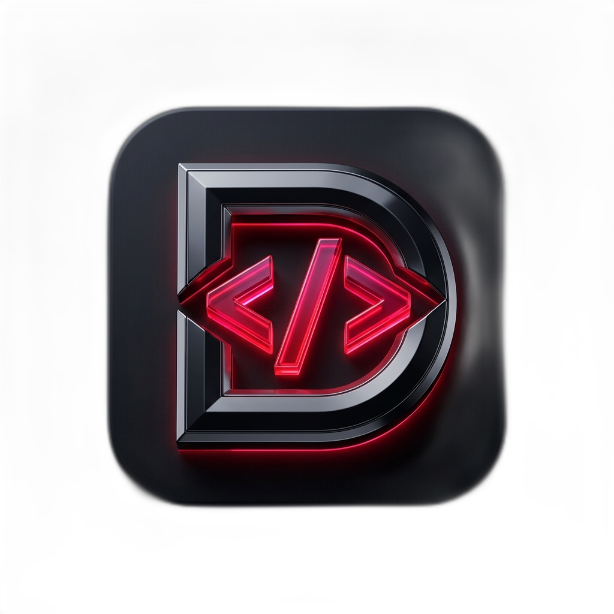
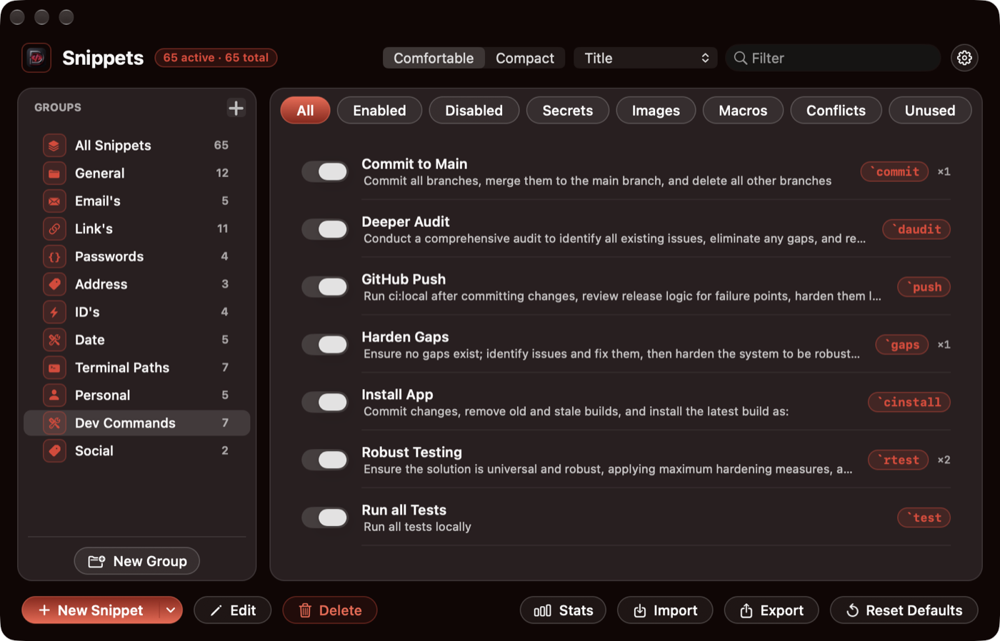

<p align="center"></p>

# DevType

**Less typing. More of your own words.**

A native macOS menu bar app for reusable snippets, voice dictation, on-device writing tools, and deliberately copied secrets. Built with Swift and AppKit. Free and open source under the MIT license.

[Download for macOS](https://github.com/bharathvbcr/DevType/releases/latest) · [User guide](docs/USER_GUIDE.md) · [Documentation](docs/README.md) · [Release notes](docs/releases/)



## What you can do

- **Expand a few characters into the text you reuse.** Organize text, image, template, and AI-action snippets into groups. Import TextExpander bundles or Espanso YAML; export to JSON, YAML, an Espanso folder, or CSV.
- **Find it with `⌘/`.** Search snippets, calculate, insert dates, change case, format JSON, generate UUIDs, or run a custom AI instruction. Structured queries such as `group:"Client Work" -tag:draft` narrow your library.
- **Work on selected text with `⌘⌥A`.** Proofread, rewrite, condense, translate, and use code-oriented actions through Apple Foundation Models. Remove Markdown and other deterministic text operations also work without an AI model.
- **Dictate with `⌘⌥V`.** Choose Apple Speech, Local AI, Local Whisper, or optional Gemini cloud transcription. Type progressively, preview in the floating bubble, or insert at the end.
- **Keep secrets separate.** Add passwords in **Copy Secret → Manage Secrets…**, then deliberately copy and paste. Secrets have no typed trigger. Values live in encrypted storage, separate from snippet exports.
- **Control where expansion happens.** Mute apps, pause during secure input, rebind global shortcuts, and choose whether Backspace reverses a recent expansion.

## Start here

1. Download a `.dmg` from [GitHub Releases](https://github.com/bharathvbcr/DevType/releases/latest), move **DevType.app** to **Applications**, and open it.
2. Follow the permission setup for **Accessibility** and **Input Monitoring**. See [permission recovery](docs/PERMISSIONS_GUIDE.md) if macOS does not recognize the grant.
3. Open **Snippet Manager** from the menu bar. Create a text snippet with trigger `;sig` and a short signature, then try it in a regular text field.
4. Open **Preferences → Hotkeys** to review the palette, AI, and voice shortcuts.

The repository's release workflow permits ad-hoc signed, unnotarized builds. Read the notes for the artifact you download; signing and Gatekeeper approval are different checks. See [installation help](docs/USER_GUIDE.md#installation).

## Requirements

| Feature | Requirement |
|---|---|
| Snippets, palette, deterministic text tools, Secrets | macOS 14 or later; core expansion needs Accessibility and Input Monitoring |
| Apple Foundation Models actions | macOS 26 or later, a compatible Mac, Apple Intelligence enabled, and an available system model |
| Dictation | Microphone permission and a ready selected recognizer; Apple transcription and live previews also use Speech Recognition permission |
| Local Whisper / local model correction | A ready loopback server and its model; setup may require downloads |
| Gemini dictation | Your Google API key plus separate cloud-audio consent |

App availability and model readiness are separate. Preferences reports the selected engine's current state; an OS version alone does not guarantee it can run.

## Shortcuts

| Default global shortcut | Action |
|---|---|
| `⌘/` | Command palette |
| `⌘⌥A` | AI action palette for selected text |
| `⌘⌥V` | Voice dictation |

These shortcuts are configurable in **Preferences → Hotkeys**. Menu commands also expose **Snippet Manager** (`⌘⇧M`), **Preferences** (`⌘,`), and **Permission Recovery** (`⌘⇧P`); they are not additional globally registered hotkeys.

## Privacy, with the boundaries explained

Trigger matching and deterministic text tools run locally. Apple Foundation Models actions use the on-device system model. DevType has no analytics or automatic update installation.

Optional features have different data paths: Gemini uploads recorded audio and instructions to Google after consent; local servers receive audio or transcript text over loopback; model setup downloads assets; update checks contact GitHub; a library placed in a synced folder is handled by your sync provider. Voice recovery stores recordings and transcripts on disk. See the [privacy policy](SECURITY.md) and [voice guide](docs/VOICE_DICTATION.md) before choosing a route.

Secret copies clear after 90 seconds only if DevType still owns the clipboard. Concealment markers request exclusion from compatible clipboard managers; they cannot prevent another app from retaining a copy. [Secrets design and limits →](SECRETS.md)

## Build and contribute

Use a full Xcode installation. The package declares Swift tools 5.9 and a macOS 14 deployment target; building the Foundation Models paths requires an SDK that includes them.

```sh
git clone https://github.com/bharathvbcr/DevType.git
cd DevType
./Scripts/test.sh
./Scripts/package-app.sh release
```

The bundle is written to `.build/DevType.app`. Use `./Scripts/signing-identity.sh` to inspect the selected identity. Packaging, local installation, and release publication are distinct operations; the [developer guide](docs/DEVELOPMENT.md) covers each.

[Contributing](CONTRIBUTING.md) · [Architecture](docs/ARCHITECTURE.md) · [Support](SUPPORT.md) · [Security reports](SECURITY.md#-reporting-a-vulnerability)

## Contributors

<!-- ALL-CONTRIBUTORS-LIST:START - Do not remove or modify this section -->
<!-- prettier-ignore-start -->
<!-- markdownlint-disable -->
<table>
  <tbody>
    <tr>
      <td align="center" valign="top" width="14.28%"><a href="https://github.com/bharathvbcr"><br /><sub><b>Bharath Chandra Vaddaram</b></sub></a><br /><a href="#code-bharathvbcr" title="Code">💻</a> <a href="#doc-bharathvbcr" title="Documentation">📖</a> <a href="#design-bharathvbcr" title="Design">🎨</a> <a href="#maintenance-bharathvbcr" title="Maintenance">🚧</a> <a href="#security-bharathvbcr" title="Security">🛡️</a> <a href="#test-bharathvbcr" title="Tests">⚠️</a> <a href="#infra-bharathvbcr" title="Infrastructure">🚇</a></td>
    </tr>
  </tbody>
</table>

<!-- markdownlint-restore -->
<!-- prettier-ignore-end -->

<!-- ALL-CONTRIBUTORS-LIST:END -->

## License and acknowledgements

[MIT](LICENSE). See [NOTICE](NOTICE) for component attributions. Voice workflow inspiration includes [Google Gemini Jot](https://github.com/google-gemini/jot-gemini-transcribe-macOS); local Whisper integration uses [whisper.cpp](https://github.com/ggml-org/whisper.cpp).
