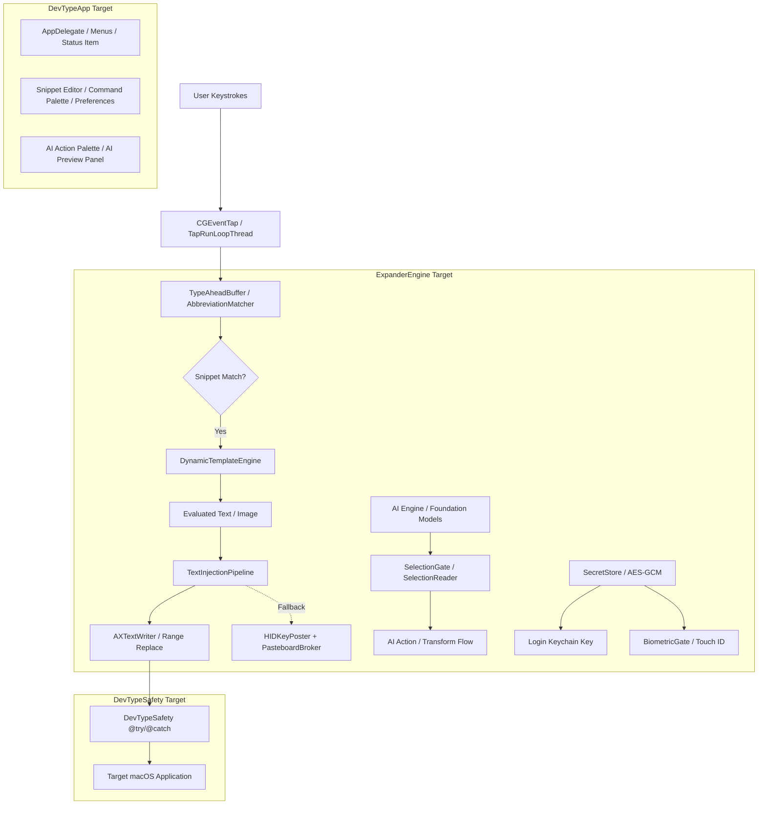
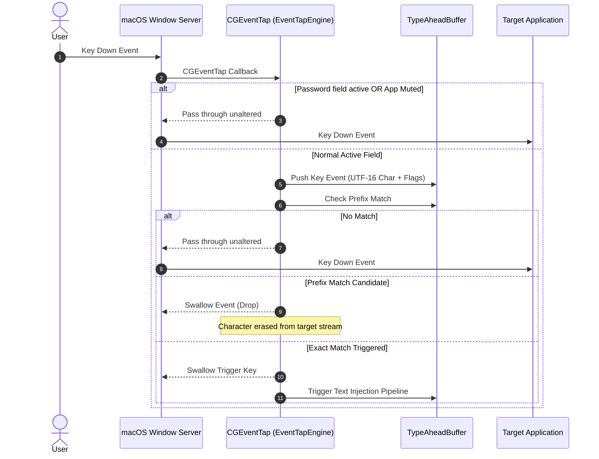
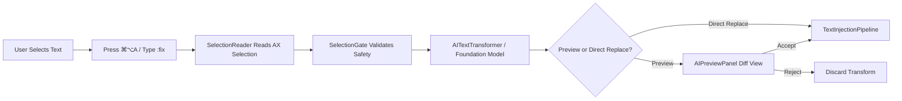

# DevType Technical Architecture & Internals

This document provides a deep technical walkthrough of the architecture, internal subsystems, concurrency models, and security boundaries in **DevType**.

---

## 🏛️ High-Level Architecture Overview

DevType is structured into three SwiftPM targets designed for separation of concerns, testability, and crash resilience:

---

## 📦 Target Breakdown

### 1. `ExpanderEngine` (Swift Target)
The headless core library containing all business logic, matching algorithms, injection pipelines, macro evaluators, and storage models.
- **Independence**: Has zero UI/AppKit window dependencies, enabling fast, headless unit testing in CI.
- **Thread Safety**: Concurrency is managed via `UnfairLock` and dedicated serial run loop threads to guarantee sub-millisecond response times without race conditions.

### 2. `DevTypeSafety` (Objective-C Target)
An Objective-C trampoline layer that wraps fragile macOS Accessibility (`AXUIElement`) and Cocoa Pasteboard APIs in `@try / @catch` blocks. Swift cannot natively catch Objective-C runtime exceptions (e.g. `NSGenericException` or corrupted AX pointers); this layer ensures such crashes are contained and degraded to safe fallbacks.

### 3. `DevTypeApp` (Executable Target)
The AppKit application layer providing the menu bar status item, snippet editor, inline search palette (`⌘/`), AI action palette (`⌘⌥A`), live diff preview, and onboarding setup wizard.
- **Main Thread Isolation**: All UI components strictly operate on `@MainActor`.

---

## ⚡ Subsystem Deep-Dives

### 1. Keystroke Interception & Event Tap Engine

Keystroke interception is managed by `EventTapEngine` and `TapRunLoopThread`:

- **Swallowing Ring Buffer**: Intercepted keystrokes are evaluated against active triggers. If an abbreviation prefix is matched, the event tap swallows the keystrokes so they never render in the target document.
- **Dead Keys & IME**: The engine tracks input source states, dead keys (accents), and IME composition to prevent breaking non-Latin and accented typing flows.
- **Fail-Closed Security**: `SecureInputMonitor` continuously checks `IsSecureEventInputEnabled()` and `AXContextChecker` checks for `NSSecureTextField`. If active, the event tap immediately yields to ensure password privacy.

---

### 2. Text Injection Pipeline

Once a snippet match is triggered, `TextInjectionPipeline` coordinates text replacement:

1. **Accessibility Range Replacement (Primary)**:
   - `AXContextChecker` retrieves the focused `AXUIElement`.
   - `AXTextWriter` attempts atomic range replacement of the trigger characters using `kAXSelectedTextRangeAttribute` and `kAXValueAttribute`.
   - **Advantage**: Instant, zero clipboard pollution, and non-disruptive to the user's pasteboard.

2. **HID Keystroke & Pasteboard Broker (Fallback)**:
   - If Accessibility write APIs are blocked (e.g. in some terminal emulators or web apps), the pipeline falls back to synthetic HID events.
   - `ErasePlan` / `EraseExecutor` posts synthetic backspaces (`kVK_Delete`) to erase the typed trigger.
   - `PasteboardBroker` snapshots existing clipboard contents, places the snippet text on the clipboard, simulates `⌘V`, and restores the original clipboard content after paste confirmation.

---

### 3. Dynamic Template & Macro Engine

The `DynamicTemplateEngine` parses and evaluates snippet bodies at expansion time:

- **Mustache Syntax (`{{...}}`)**:
  - `{{date}}`, `{{date:yyyy-MM-dd}}`: Evaluates current dates with formatting tokens.
  - `{{time}}`: Inserts current timestamps.
  - `{{clipboard}}`: Injects current clipboard contents on demand.
  - `{{calc: <expr>}}`: Evaluates safe arithmetic expressions via `SafeMathParser` (strictly bounded, no arbitrary code execution).
  - `{{cursor}}`: Calculates the final caret offset and posts arrow keys to reposition the cursor.
  - `{{snippet:<trigger>}}`: Recursively resolves nested snippets (depth limited to 10 to prevent infinite recursion).

- **TextExpander Syntax (`%...%`)**:
  - `%filltext:name=Field%`: Triggers interactive fill-in popup sheets before insertion.
  - `%date:FORMAT%`, `%clipboard`, `%|` (cursor position), `%key:enter%`.

---

### 4. On-Device AI Engine (Apple Foundation Models)

DevType integrates on-device Apple Foundation Models (macOS 26+) for local AI text operations:

- **Zero Cloud Privacy**: Models execute strictly on the Apple Neural Engine / GPU via local Apple Intelligence APIs. Zero bytes are sent over the network.
- **Interactive Actions**: Proofreading, rewriting, condensing, expanding, tone shifting (friendly/formal), bulletizing, and prompt enhancement.
- **Undo Integration**: Transformed text can be reverted with standard `⌘Z` or DevType's AI Undo Store.

---

### 5. Encrypted Secret Snippets Storage

Sensitive credentials are partitioned away from standard snippet files:

- **Storage**: Sealed using **AES-GCM (256-bit)** in a dedicated encrypted file (`secrets.enc`) with `0600` file permissions.
- **Master Key**: Generated with `SecRandomCopyBytes` and stored strictly in the macOS **Login Keychain** under the service `com.devtype.app.secret-master-key`.
- **Biometric Gate**: Access requires biometric authentication (`LocalAuthentication` / Touch ID) or system password.
- **Concealed Clipboard**: Copied secrets are marked with `org.nspasteboard.ConcealedType` to hide them from third-party clipboard managers, and are auto-purged from memory after 90 seconds.

---

## 🔒 Concurrency & Threading Model

To ensure zero dropped keystrokes and fluid UI responsiveness:

| Component | Execution Context | Synchronization Primitive |
|---|---|---|
| **Event Tap Callback** | Dedicated `CFRunLoop` (`TapRunLoopThread`) | Non-blocking ring buffer |
| **Abbreviation Matching** | High-priority background queue | Read-Copy-Update / Trie |
| **Snippet Store** | Background utility queue | `UnfairLock` (OSAllocatedUnfairLock) |
| **Secret Store** | Background security queue | Keychain API + AES-GCM |
| **AppKit UI / Panels** | Main Thread (`@MainActor`) | Swift Concurrency |

---

## 🛡️ Exception Safety & Resilience

macOS Accessibility elements (`AXUIElementCopyAttributeValue`, `AXUIElementSetAttributeValue`) can unpredictably fail or throw exceptions when applications terminate abruptly. DevType implements:

1. **`DevTypeSafety` Objective-C Gateways**: Every AX call and Pasteboard snapshot is wrapped in `@try / @catch`.
2. **Double-Injection Guards**: Prevents re-entrant expansion loops.
3. **Automatic Event Tap Recovery**: If the macOS window server disables the event tap due to system lag (`kCGEventTapDisabledByTimeout`), DevType automatically catches the event and re-enables the tap.
