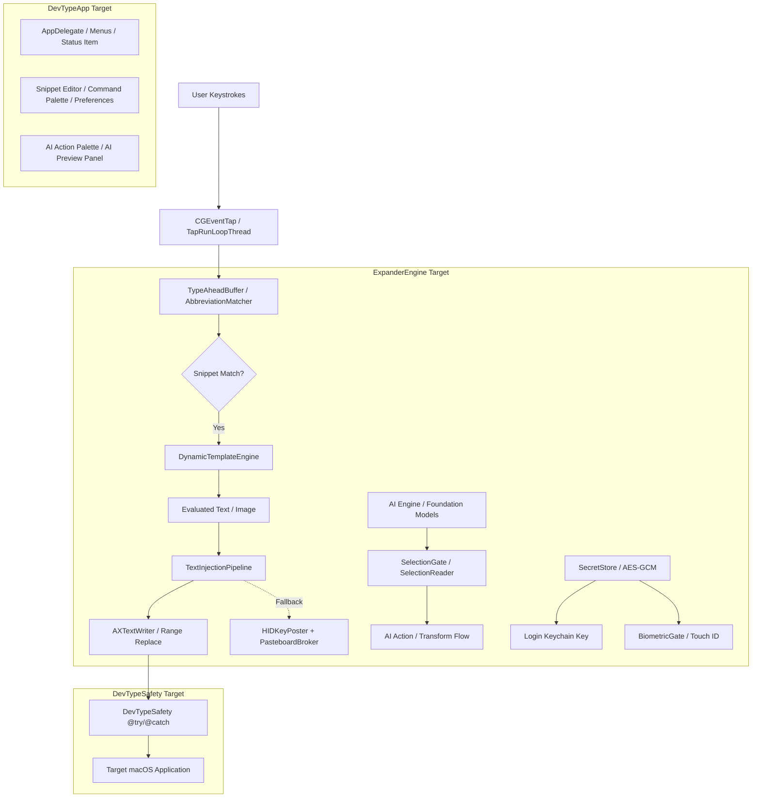
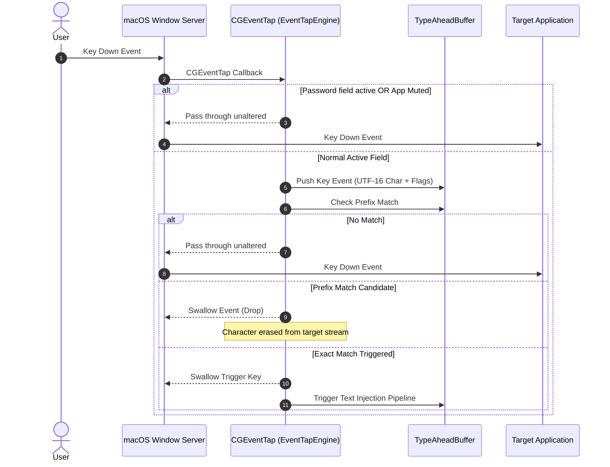
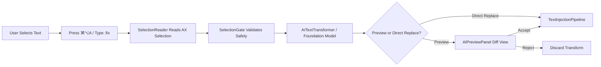

# DevType Technical Architecture & Internals

This document provides a deep technical walkthrough of the architecture, internal subsystems, concurrency models, and security boundaries in **DevType**.

---

## 🏛️ High-Level Architecture Overview

DevType is structured into three SwiftPM targets designed for separation of concerns, testability, and crash resilience:

---

## 📦 Target Breakdown

### 1. `ExpanderEngine` (Swift Target)
The headless core library containing all business logic, matching algorithms, injection pipelines, macro evaluators, and storage models.
- **Independence**: Has zero UI/AppKit window dependencies, enabling fast, headless unit testing in CI.
- **Thread Safety**: Concurrency is managed via `UnfairLock` and dedicated serial run loop threads to guarantee sub-millisecond response times without race conditions.

### 2. `DevTypeSafety` (Objective-C Target)
An Objective-C trampoline layer that wraps fragile macOS Accessibility (`AXUIElement`) and Cocoa Pasteboard APIs in `@try / @catch` blocks. Swift cannot natively catch Objective-C runtime exceptions (e.g. `NSGenericException` or corrupted AX pointers); this layer ensures such crashes are contained and degraded to safe fallbacks.

### 3. `DevTypeApp` (Executable Target)
The AppKit application layer providing the menu bar status item, snippet editor, inline search palette (`⌘/`), AI action palette (`⌘⌥A`), live diff preview, and onboarding setup wizard.
- **Main Thread Isolation**: All UI components strictly operate on `@MainActor`.

---

## ⚡ Subsystem Deep-Dives

### 1. Keystroke Interception & Event Tap Engine

Keystroke interception is managed by `EventTapEngine` and `TapRunLoopThread`:

- **Swallowing Ring Buffer**: Intercepted keystrokes are evaluated against active triggers. If an abbreviation prefix is matched, the event tap swallows the keystrokes so they never render in the target document.
- **Dead Keys & IME**: The engine tracks input source states, dead keys (accents), and IME composition to prevent breaking non-Latin and accented typing flows.
- **Fail-Closed Security**: `SecureInputMonitor` continuously checks `IsSecureEventInputEnabled()` and `AXContextChecker` checks for `NSSecureTextField`. If active, the event tap immediately yields to ensure password privacy.

---

### 2. Text Injection Pipeline

Once a snippet match is triggered, `TextInjectionPipeline` coordinates text replacement:

1. **Accessibility Range Replacement (Primary)**:
   - `AXContextChecker` retrieves the focused `AXUIElement`.
   - `AXTextWriter` attempts atomic range replacement of the trigger characters using `kAXSelectedTextRangeAttribute` and `kAXValueAttribute`.
   - **Advantage**: Instant, zero clipboard pollution, and non-disruptive to the user's pasteboard.

2. **HID Keystroke & Pasteboard Broker (Fallback)**:
   - If Accessibility write APIs are blocked (e.g. in some terminal emulators or web apps), the pipeline falls back to synthetic HID events.
   - `ErasePlan` / `EraseExecutor` posts synthetic backspaces (`kVK_Delete`) to erase the typed trigger.
   - `PasteboardBroker` snapshots existing clipboard contents, places the snippet text on the clipboard, simulates `⌘V`, and restores the original clipboard content after paste confirmation.

---

### 3. Dynamic Template & Macro Engine

Snippet bodies are rendered by two cooperating parsers — `MacroParser` (TextExpander `%...%` syntax) and `DynamicTemplateEngine` (Mustache `{{...}}` syntax) — sharing one pipeline:

- **Mustache Syntax (`{{...}}`)**:
  - `{{date}}`, `{{date:yyyy-MM-dd}}`: Named presets (16, e.g. `us`, `iso`, `eu`, `full`) or raw Unicode patterns.
  - `{{date:iso:+1d}}`, `{{date:+1w}}`: Date arithmetic through calendar-safe offsets (`y M w d h m s` units).
  - `{{time}}`: Localized timestamp.
  - `{{clipboard}}`: Injects clipboard contents on demand. Clipboard text is sanitized first so pasted content can never re-trigger macros.
  - `{{calc: <expr>}}`: Evaluates safe arithmetic via `SafeMathParser` (strictly bounded: ≤ 64 chars / 48 tokens, no arbitrary code execution; malformed input is left as literal text).
  - `{{cursor}}`: Calculates the final caret offset and posts arrow keys to reposition the cursor. First marker wins.
  - `{{snippet:<trigger>}}`: Recursively resolves nested snippets (depth limited to 10, plus a global budget of 10k substitutions / 2 MB output per pass).
  - `{{uuid}}`, `{{random:1-100}}`, `{{counter:name}}`: Generated values (random specs also accept choice lists and `hex:`/`alnum:`/`digits:`/`letters:` forms; counters persist across launches).
  - `{{upper:…}}` / `{{lower:…}}` / `{{title:…}}` / `{{sentence:…}}`: Locale-aware case transforms that nest innermost-first.

- **TextExpander Syntax (`%...%`)**:
  - Fill-ins: `%filltext:name=X%`, `%fillarea%`, `%fillpopup%`, optional `%fillpart:name=X:default=yes% … %fillpartend%` sections.
  - `%date:FORMAT%` (presets/patterns/offsets), TextExpander date math via `%@+1D%`.
  - `%clipboard`, `%|` (cursor position), `%key:enter%` / `return` / `tab` / `esc` / `space`.
  - `%snippet:<abbrev>%` nesting with the same depth/budget bounds.
  - Generated values `%uuid%`, `%random:1-100%`, `%counter:name%`; case blocks `%case:upper% … %caseend%`.
  - `%%` escapes a literal `%` inside macro bodies; unknown `%…%` sequences pass through untouched.

Both engines resolve nested snippets in place without disturbing sibling macros, and secret snippets are structurally excluded from nesting lookups.

---

### 4. On-Device AI Engine (Apple Foundation Models)

DevType integrates on-device Apple Foundation Models (macOS 26+) for local AI text operations:

- **Zero Cloud Privacy**: Models execute strictly on the Apple Neural Engine / GPU via local Apple Intelligence APIs. Zero bytes are sent over the network.
- **Interactive Actions**: Proofreading, rewriting, paraphrasing, condensing, expanding, tone shifting (friendly/formal), bulletizing, prompt enhancement, and translation (→ English from romanized Telugu/Hindi or native script; English → romanized Telugu/Hindi).
- **Delivery Modes**: Each kind declares `direct` or `preview` output. Proofread defaults to direct in-place replacement; the rest stream into a diff preview panel (Replace / Copy / Retry / Cancel). Users can override per kind in Preferences → AI.
- **Layered Output Defense**: `AIPromptLeakGuard` extracts instruction clauses corpus-wide and fails closed on injection-boundary verdicts; a per-generation echo stripper removes prompt framing the model repeats back; post-generation checks enforce script policy (e.g. romanized-only translations) and line-structure preservation for correction-style kinds.
- **Diagnostics Without Content**: `AIDiagnosticsStore` keeps a bounded ring of failure labels and selection-read evidence — bundle IDs, probe summaries, elapsed ms, character *counts* only — feeding the `-- On-device AI --` section of the diagnostic report. No selection text ever reaches logs.
- **Undo Integration**: Transformed text can be reverted with standard `⌘Z` or DevType's AI Undo Store (**Undo last AI** in the Command Palette).

---

### 5. Encrypted Secret Snippets Storage

Sensitive credentials are partitioned away from standard snippet files. Since the §8.11 redesign, storage is **file-first**:

- **Archive**: Each value is sealed with **CryptoKit AES-GCM** (fresh random nonce per seal; nonce + ciphertext + tag as one base64 blob) into a versioned JSON archive (`~/Library/Application Support/DevType/secrets.enc`, `0600`, atomic writes). Bytes the current build cannot vouch for are quarantined aside, never overwritten.
- **Master Key**: One 256-bit key generated with `SecRandomCopyBytes` — the *only* keychain object. It lives in the login keychain under service `com.devtype.app.secret.v2`, account `com.devtype.masterkey`, is fetched at most once per process, and is warmed into memory at launch while the keychain is still unlocked (so copies keep working after an auto-lock). Consolidation from earlier per-item generations (§8.9/§8.10 services) happens automatically and losslessly.
- **Cross-Process Locking**: Every archive read-modify-write holds a `flock(LOCK_EX)` on `<archive>.lock`; if the descriptor cannot be opened the operation proceeds but records a loud diagnostics note.
- **Biometric Gate**: Access requires biometric authentication (`LocalAuthentication` / Touch ID) or system password, with a 30-second reuse window invalidated on app resign-active.
- **Concealed Clipboard**: Copied secrets are marked with `org.nspasteboard.ConcealedType` to hide them from third-party clipboard managers, and are auto-purged after 90 seconds — only if the pasteboard still holds our write.
- **Structural Redaction**: Secret values are absent from the snippet model's encoded form by construction, so they can never reach the library JSON, any export, the editor after save, or diagnostic reports.

---

## 🔒 Concurrency & Threading Model

To ensure zero dropped keystrokes and fluid UI responsiveness:

| Component | Execution Context | Synchronization Primitive |
|---|---|---|
| **Event Tap Callback** | Dedicated `CFRunLoop` (`TapRunLoopThread`) | Non-blocking ring buffer |
| **Abbreviation Matching** | High-priority background queue | Read-Copy-Update / Trie |
| **Snippet Store** | Background utility queue | `UnfairLock` (OSAllocatedUnfairLock) |
| **Secret Archive** | Background security queue | AES-GCM + cross-process `flock` |
| **AppKit UI / Panels** | Main Thread (`@MainActor`) | Swift Concurrency |

---

## 🛡️ Exception Safety & Resilience

macOS Accessibility elements (`AXUIElementCopyAttributeValue`, `AXUIElementSetAttributeValue`) can unpredictably fail or throw exceptions when applications terminate abruptly. DevType implements:

1. **`DevTypeSafety` Objective-C Gateways**: Every AX call and Pasteboard snapshot is wrapped in `@try / @catch`.
2. **Double-Injection Guards**: Prevents re-entrant expansion loops.
3. **Automatic Event Tap Recovery**: If the macOS window server disables the event tap due to system lag (`kCGEventTapDisabledByTimeout`), DevType automatically catches the event and re-enables the tap.

---

## 🔬 Injection Reliability Kit

Expansion correctness is verified, not assumed. The pipeline carries a set of evidence-producing collaborators:

| Component | Role |
|---|---|
| `DeliveryVerifier` | Three-outcome verification (delivered / not delivered / unverifiable) of injected text — "no news" is never treated as success. |
| `PasteboardBroker` | Owns the snapshot → paste → restore invariant for the HID fallback, with clipboard-residency policy and stall probes so a slow target app cannot eat the user's original clipboard. |
| `TypeAheadBuffer` | Holds keystrokes typed during an async paste and replays them in order afterwards. |
| `ErasePlan` / `EraseExecutor` | Grapheme-correct trigger erasure (AX ranges are UTF-16 units; backspaces remove graphemes), with preconditions verified before any destructive erase. Whitespace folding treats NBSP variants as typed space during field comparisons. |
| `AXWriteCapabilityStore` | Learns per-app whether AX writes truly work (Electron/Chromium apps can report false success) and routes future expansions down the reliable path. |
| `InjectTimingStore` | Measures per-app paste delivery times so hold delays adapt instead of using fixed worst-case waits. |
| `InjectTelemetryLog` | Bounded ring of recent injection outcomes feeding diagnostics — bundle ID, path taken, outcome, refuse reason. |

**Held expansion**: When two triggers share a prefix (`` `slm `` vs `` `slmabout ``), `HeldExpansionCoordinator` + `TriggerPrefixIndex` hold the match for a debounce window so longer triggers stay reachable, serialized across the tap thread, main thread, and timers.

**Synthetic-event marker**: Reinjected keys carry a magic `userData` tag (`0x534E_4950`, "SNIP") so the event tap never mistakes its own output for typing — closing the re-expansion loop class of bugs.

---

## 🔍 Search & Ranking

The Command Palette and snippet search are offline-first:

- `SnippetSearch` folds diacritics/case/width with a per-character origin table so highlight ranges stay correct across grapheme clusters; fields searched: trigger, title, group, content.
- `UsageStatsStore` (snippets, UUID-keyed) and `CommandUsageStatsStore` (palette commands, string-keyed) compute a saturating frequency boost (~log₂ of use count) plus a recency kicker within 7 days, capped at 12 points — deliberately bounded so a hot item cannot outrank an exact trigger match.
- Optional Stage-1 semantic boost uses offline `NLEmbedding` word vectors to reorder results; it never blocks rendering. A model-backed Stage-2 router (`PaletteToolRouter`) exists behind a preference flag and ships off by default.
- Query-level result caches are keyed by library fingerprint, usage-stats revision, UI language, and clipboard state, then invalidated wholesale on changes.
