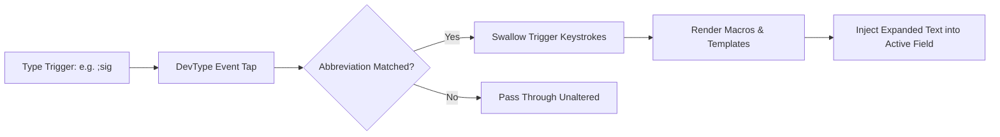
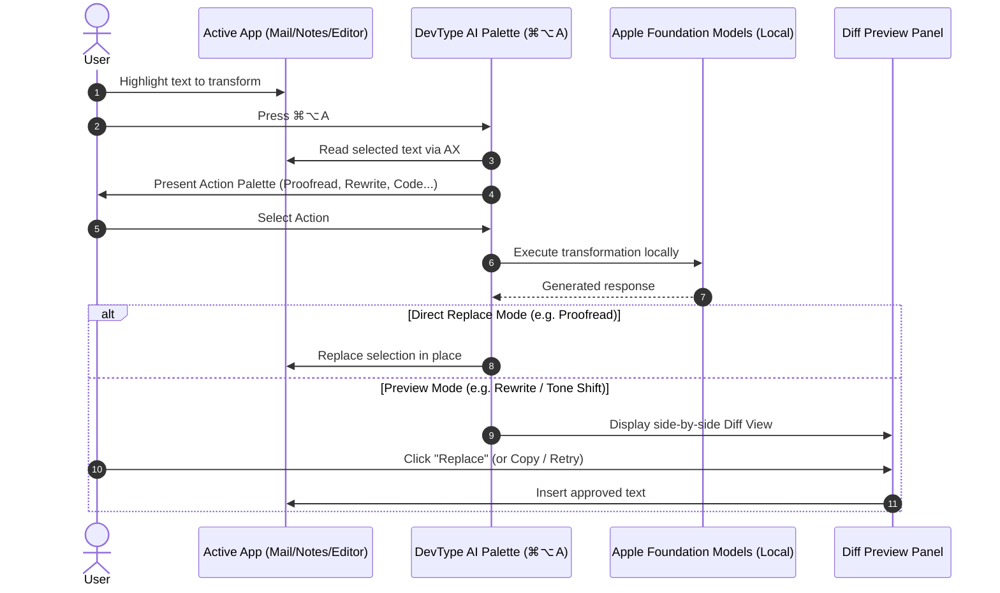
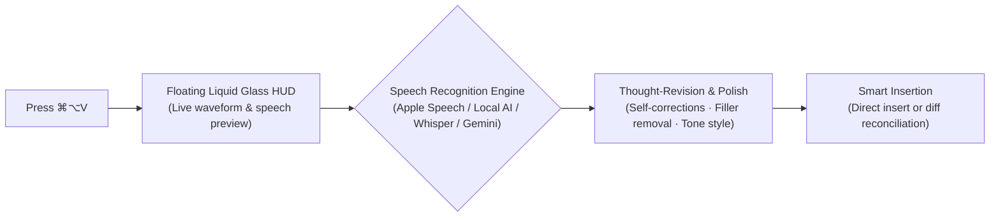

# DevType User Guide

[All documentation](README.md) · [Support](../SUPPORT.md)

Welcome to the comprehensive user manual for **DevType** — the fast, native macOS text expander and on-device AI writing assistant.

---

## 📑 Table of Contents
1. [Installation](#installation)
2. [Permissions Setup](#2-permissions-setup)
3. [Creating & Managing Snippets](#3-creating--managing-snippets)
4. [Using Dynamic Macros & Templates](#4-using-dynamic-macros--templates)
5. [On-Device AI Assistant (macOS 26+)](#5-on-device-ai-assistant-macos-26)
6. [Smart Voice Dictation (`⌘⌥V`)](#6-smart-voice-dictation-v)
7. [Fuzzy Command Palette (`⌘/`)](#7-fuzzy-command-palette-)
8. [Secrets & Touch ID](#8-secrets--touch-id)
9. [Importing & Exporting Libraries](#9-importing--exporting-libraries)
10. [Preferences & Customization](#10-preferences--customization)
11. [Troubleshooting & FAQs](#11-troubleshooting--faqs)

---

## Installation

### Download Release
1. Download the latest `.dmg` from the [GitHub Releases Page](https://github.com/bharathvbcr/DevType/releases/latest).
2. Open the disk image and drag **DevType.app** to your `/Applications` folder.
3. Launch DevType from `/Applications` or Spotlight (`⌘Space`).

Read the release notes for signing status. The release workflow permits ad-hoc signed, unnotarized artifacts, which Gatekeeper may refuse. If you trust the downloaded source, use macOS **Privacy & Security → Open Anyway** when offered. Do not disable Gatekeeper globally.

Core features require macOS 14+. Apple Foundation Models actions additionally require macOS 26+, a compatible Mac, Apple Intelligence enabled, and an available model.

---

## 2. Permissions Setup

When you first launch DevType, the **Permissions Setup Wizard** will guide you through granting two standard macOS privacy permissions:

1. **Accessibility**: Allows DevType to perform fast, non-intrusive text replacement directly inside your active application.
2. **Input Monitoring**: Enables DevType to listen for your typed snippet triggers and swallow the trigger characters.

> [!TIP]
> For a detailed guide and troubleshooting tips for permissions, see the [Permissions Guide](PERMISSIONS_GUIDE.md).

---

## 3. Creating & Managing Snippets

### Opening the Snippet Manager
Click the **DevType icon** in your macOS menu bar and select **Snippet Manager…** (or press `⌘⇧M`).

### Creating a New Snippet
1. Click the **`+`** button in the bottom toolbar.
2. **Label / Title**: A descriptive name (e.g. `Work Email Signature`).
3. **Trigger / Abbreviation**: The keyword you type to activate the snippet (e.g. `;sig` or `:email`).
4. **Snippet Content**: The replacement text.



### Snippet Types
- **Plain Text**: Standard text expansion.
- **Dynamic Template**: Text containing Mustache (`{{...}}`) or TextExpander (`%...%`) macro tags.
- **Image Snippets**: Paste a rich image directly from a trigger keyword.
- **AI Action Snippets**: Triggers that run an on-device AI transform over your current text selection (created from the built-in template catalog or the editor).

Secrets are managed separately in **menu bar → Copy Secret → Manage Secrets…**; they are not a snippet type in the editor.

### Searching Snippets
Type in the search field at the top of the Snippet Manager to quickly filter your library. Multi-word queries match conjunctively across triggers, labels, tags, and content (e.g. `sig email`), matching the same ranking logic used in the Command Palette.

---

## 4. Using Dynamic Macros & Templates

DevType supports rich dynamic macros. You can mix and match Mustache tags or TextExpander syntax:

### Date & Time
- `{{date}}`: Inserts today's date in your system locale.
- `{{date:yyyy-MM-dd}}`: Custom date pattern (e.g. `2026-08-16`).
- `{{date:us}}` / `{{date:iso}}`: Preset formatting.
- `{{date:iso:+1d}}` / `%@+1D%`: Date arithmetic — offset by days, weeks, months, hours, and more.
- `{{time}}`: Current time.

### Dynamic Clipboard & Caret
- `{{clipboard}}` / `%clipboard`: Inserts the current clipboard text literally. Template-shaped text such as `{{cursor}}` is preserved and does not run as another macro.
- `{{cursor}}` or `%|`: Places your caret at that position after all substitutions and case transforms. The first marker wins across both syntaxes, including snippets with emoji or length-changing Unicode text.
- `{{snippet:other_trigger}}` / `%snippet:other_trigger%`: Re-uses content from another snippet dynamically.

### Safe Inline Calculations
- `{{calc: 15 * 4}}` → `60`
- `{{calc: (1200 / 12) + 8}}` → `108`

### Generated Values
- `{{uuid}}`, `{{random:1-100}}`, `{{random:hex:8}}`: Fresh values on every expansion.
- `{{counter:name}}` / `%counter:name%`: Persistent counters that bump on each expansion (optional step, e.g. `%counter:tickets:+5%`).

### Case Transforms
- `{{upper:…}}` / `{{lower:…}}` / `{{title:…}}` / `{{sentence:…}}`
- TextExpander block form: `%case:upper% … %caseend%`.

### Interactive Fill-in Fields
Need to prompt yourself for a variable before inserting? Use TextExpander fill-in tags:
```text
Hi %filltext:name=Client Name%,

Thank you for reaching out regarding %filltext:name=Project%. We will follow up by %date:full%.

Best,
Alex
```
Typing the trigger opens a dialog for the field values before expansion. Multi-line (`%fillarea%`), drop-down (`%fillpopup%`), and optional sections (`%fillpart%…%fillpartend%`) are supported too.

For the full list of tags and modifiers, see the [Macro Reference Guide](MACRO_REFERENCE.md).

---

## 5. On-Device AI Assistant (macOS 26+)

DevType comes with private, on-device AI writing tools powered by Apple Foundation Models, alongside local offline text tools:



1. **Highlight Text** in any application.
2. Press **`⌘⌥A`** (Command + Option + A).
3. Choose an Action:
   - ✍️ **Proofread**: Fix grammar, punctuation, and typos directly in place.
   - 🔄 **Rewrite** / 🗣️ **Paraphrase**: Polish text for clarity, flow, or fresh wording.
   - 🔀 **Merge & Rewrite**: Deduplicate and fold overlapping notes, fragments, or resume bullets into one coherent passage with instructions to preserve facts and formatting. Review the result before accepting it.
   - 📈 **Expand** / 📉 **Condense**: Elaborate on ideas or tighten text while preserving meaning.
   - 👔 **Tone Shift**: Make text more *Formal* or *Friendly*.
   - 📋 **Bulletize**: Transform paragraph text into clean bullet points.
   - 💡 **Prompt Enhance**: Rewrite a draft into a sharper LLM prompt.
   - 🧑‍💻 **Code Engineering**:
     - **Explain Code**: Algorithmic and logic breakdown.
     - **Docstring Generator**: Generate language-idiomatic doc comments (SwiftDoc, JSDoc, PyDoc, RustDoc).
     - **Fix Code**: Detect and repair logic bugs and syntax issues.
     - **Unit Test Generator**: Draft tests for selected code; run and review them in your project.
     - **Explain Regex**: Plain-English token-by-token regular expression explanation.
     - **SQL Query Generator**: Draft SQL from natural-language requests.
   - 📦 **Git Commit Message**: Conventional commit summaries (`feat:`, `fix:`, `refactor:`) from diffs.
   - 🗂️ **JSON Converter**: Convert lists, tables, or unformatted data into clean JSON.
   - 🌐 **Translate**: To English from romanized Telugu/Hindi (or native script), or English → romanized Telugu / Hindi.
   - 📝 **Markdown Tools**:
     - **Convert to Markdown**: Format plain text into clean Markdown headings, lists, and code blocks.
     - **Remove Markdown** *(Offline on macOS 14+)*: Strip Markdown formatting into clean plain prose locally without requiring an AI model.
   - ⌨️ **Custom Prompt**: Type your own instruction (e.g. `> Translate to Spanish`) — also available directly from the Command Palette with a `>` prefix.

### Live Diff Preview
Proofread and Remove Markdown replace in place by default; every other action streams into a preview panel showing the result (with diff view). Press `Enter` to accept, `Esc` to discard, or use Retry to re-roll the result. Per-action delivery can be switched between direct replace and preview under **Preferences → AI**, and **Undo last AI** at the top of the Command Palette reverts the most recent transform.

---

## 6. Smart Voice Dictation (`⌘⌥V`)

DevType includes local-first, privacy-respecting speech-to-text dictation with thought-revision processing inspired by Google Gemini Jot:



- **Push-to-Talk or Toggle**: Press or hold **`⌘⌥V`** to dictate into whatever application has focus.
- **Selectable Recognizers** in **Preferences → Voice**:
  - 🍎 **Apple Speech**: On-device recognition with deterministic formatting. macOS 26 prefers SpeechAnalyzer when ready; the legacy recognizer is a readiness-checked fallback. Locale support, permissions, and speech assets matter.
  - 🧠 **Local AI**: On-device Apple Speech recognition polished by local Apple Intelligence Foundation Models (macOS 26+) or a local HTTP endpoint (Ollama / llama.cpp).
  - ⚡ **Local Whisper**: Talks to a local `whisper.cpp` server on loopback (`http://127.0.0.1:8080/inference`). Runs locally once its server and model are ready. Setup can require a model download.
  - ☁️ **Gemini 3.5 Transcribe**: Opt-in cloud engine with native disfluency and punctuation handling. Inert until you store your own API key in your login Keychain and separately grant cloud-audio consent in Preferences; a missing prerequisite is refused before recording.
- **Thought-Revision & Smart Polish**: Automatically handles mid-sentence self-corrections ("tomorrow at 3... actually make that 4 PM"), removes verbal fillers (*"um"*, *"uh"*, *"like"*), and applies custom vocabulary.
- **Multi-Register Tone**: Style transcripts for *Natural*, *Email*, *Chat*, *Code* (identifier formatting), or *Verbatim*.
- **Liquid Glass HUD**: Non-activating floating HUD using Apple Liquid Glass (`NSGlassEffectView`) on macOS 26+ (with `NSVisualEffectView` fallback on earlier systems) that meters microphone levels and streams live partial transcripts without stealing keyboard focus.

For complete voice architecture details, see [docs/VOICE_DICTATION.md](VOICE_DICTATION.md).

---

## 7. Fuzzy Command Palette (`⌘/`)

Press **`⌘/`** anywhere in macOS to bring up DevType's unified Command Palette:

- **Selection-Aware Suggestions**: When opened with selected text, the empty palette automatically surfaces AI transforms and local text operations first, keeping perishable actions above the fold while pushing navigation down.
- **Dynamic Section Leading**: Sections are led by their best hit rather than a static commands/AI/snippets order, so a high-scoring snippet or transform immediately surfaces above lower-scoring commands.
- **Search Snippets**: Type fuzzy or multi-word keywords to find and insert snippets without remembering abbreviations. Results highlight matches, honor diacritics, and are ranked by how often (and how recently) *you* use them — the top rows show `⌘1`–`⌘9` quick-insert hints. The palette processes at most 512 characters and 12 terms per query. Body search covers the first 2,000 characters of each snippet.
- **Precise Library Search**: Use `"best regards"` for a phrase, `title:signature`, `trigger:sig`, `group:"Client Work"`, `tag:billing`, or `content:invoice` to select a field, and `-draft` or `-tag:personal` to exclude literal matches. Combine terms to narrow the result. The manager also supports `is:enabled`, `is:disabled`, `is:image`, `is:ai`, and `is:text`; the insertion palette still omits disabled entries. These filters share one search engine. Direct manager queries process at most 4,096 UTF-8 bytes and 12 terms. Queries that exceed the limits or have an empty filter value show a reason and no results. Shorten the query or finish the filter to continue; exclusions are never silently discarded.
- **Conversational Search (optional)**: Turn on **Preferences → AI → Semantic Search Routing** to let available on-device Apple Foundation Models resolve a natural-language query through DevType's date, text-operation, or snippet tools. Routing has an 8-second safety deadline; offline results appear immediately.
- **Math Calculator**: Type `= 45 * 12.5` to evaluate inline and insert or copy the result.
- **Custom AI**: Type `> make this sound like a Slack message` to run a one-shot on-device AI instruction over your current selection.
- **Date Offsets & Tools**: Type `tomorrow`, `date+7`, `+3w`, `next friday`, or `epoch` to insert calculated dates; ISO and full formats included.
- **Clipboard Tools**: Insert the current clipboard contents as text, or run a live character/word/line count preview.
- **Text Operations**: UPPERCASE, lowercase, Title Case, Sentence case, snake_case, kebab-case, camelCase, PascalCase, sort/dedupe/trim/number lines, Base64 / URL / HTML encode–decode, JSON pretty/compact, SHA-256 and MD5 digests.
- **Portable Text**: Line operations accept CRLF, CR, LF and Unicode line separators and produce LF. URL Encode encodes one URL component, including query delimiters; it does not preserve a complete URL's separators. JSON formatters accept scalar values (`true`, `42`, `null`) as well as arrays and objects. Naming tools retain Unicode letters and digits without transliteration.
- **Generators**: UUIDs, lorem ipsum, and strong random passwords.
- **Quick Navigation**: Jump straight to Preferences, the Snippet Manager, or the Permission Recovery window.

---

## 8. Secrets & Touch ID

Open **menu bar → Copy Secret → Manage Secrets…** to add a secret with a name and value. There is no trigger or shortcut to configure. The **Secrets** chip in the snippet manager opens this separate manager.

1. Add or edit a secret. Stored values are never prefilled. The editor conceals newly entered text by default; **Show/Hide** reveals only what you are entering in that sheet.
2. Select an enabled secret and copy it from the manager, **Copy Secret** submenu, or **Search Secrets**. Return copies the selected manager row; Delete removes it when the list has focus.
3. Authenticate when required. Touch ID supports a system-password fallback; the short reuse window is invalidated when DevType resigns active. Turning off an active, available authentication requirement needs fresh authentication; cancelling leaves it enabled.
4. Focus the destination and paste with `⌘V`. When macOS Secure Input is active, the menu bar's **Copy Secret** button opens Search Secrets directly. Control-click or right-click opens the full menu.

Copies clear after 90 seconds if DevType still owns the clipboard. Concealed/transient markers request exclusion from compatible clipboard managers, but cannot stop another app from retaining a copy. The submenu shows up to 20 entries and reports omitted entries; use Search Secrets for the rest.

Values are AES-GCM encrypted with a master key in Keychain. Secret metadata occupies a separate collection in the library; values do not enter library JSON or snippet exports. If storage needs attention, use **Preferences → Advanced → Repair Secret Storage**. See [Secrets](../SECRETS.md) for recovery and device-only key limitations.

---

## 9. Importing & Exporting Libraries

Easily migrate your entire snippet library:
1. In DevType, open the menu bar icon and choose **Import Snippets…** (or use the button in Preferences → Snippets).
2. Select your export file or folder:
   - **TextExpander**: a settings bundle (`.textexpandersettings`) or backup (`.textexpanderbackup`) — DevType auto-detects common sync locations.
   - **Espanso**: a config folder, `match` directory, package, or any `.yml` match file.
3. DevType automatically translates triggers, macro tags, image attachments (`image_path`), per-app filters, and case propagation. Unsupported constructs are reported cleanly rather than silently dropped.

### Exporting
Use **Export…** in the menu bar (or Preferences → Snippets) to save your library as:
- **DevType JSON**: Snippet groups and their metadata; device preferences and secret values are not included.
- **Espanso YAML**: Standard YAML configuration compatible with Espanso.
- **Espanso folder**: A `match/`-style directory containing one YAML file per group, written atomically.
- **CSV**: Spreadsheet-friendly export with columns for title, trigger, replacement, and group.

Snippet exports omit secret records and values. DevType JSON is a snippet-library export, not a backup of your encrypted secret archive or its device-only Keychain key.

Preferences → Snippets also shows the active library location. **Move Library…** copies the
library to a folder such as iCloud Drive or Dropbox, **Link to Existing…** adopts an existing
JSON library after backing up the local one, and **Stop Syncing** returns to the local store. A
failed relocation is reported without changing the active library.

---

## 10. Preferences & Customization

Open **DevType Preferences** from the menu bar or press **`⌘,`**. The window features 7 dedicated tabs:

1. 🏠 **Home**: First-class getting started dashboard displaying engine status, quick actions (New Snippet, Templates, Import), live scratchpad test field, active shortcuts summary, and top/recent snippets.
2. ⚙️ **General**: Startup settings (Launch at login), the Backspace expansion-undo switch, application language (System, English, 한국어, 日本語), opt-in update check (at most once a day, zero telemetry), and the **Muted Apps** list (apps where DevType pauses expansion).
3. 📚 **Snippets**: Secrets security configuration (Touch ID requirement), library location controls, import/export buttons, trigger-conflict detection, and detailed usage statistics.
4. ⌨️ **Hotkeys**: Customizable shortcut recorders for Command Palette (`⌘/`), AI Action Palette (`⌘⌥A`), Smart Dictation (`⌘⌥V`), and hotkey macro actions.
5. 🎙️ **Voice**: Speech engine selector (Apple Speech, Local AI, Local Whisper, Gemini) with live readiness indicators, prompt tone styles, a "While you speak" mode (type as you speak, show words in the bubble and insert at the end, or show nothing and insert at the end), custom phonetic vocabulary dictionary, voice action triggers, and microphone permissions.
6. ✨ **AI** (macOS 26+): Enable on-device transforms, configure per-action output delivery (direct replace vs diff preview), manage application allowlists, and toggle optional semantic search routing.
7. 🔧 **Advanced**: Engine options including dedicated event-tap thread toggle, memory logging, live diagnostic readout, and maintenance actions.

Muted apps are also reachable straight from the menu bar (**Mute Frontmost App**, **Muted Apps…**).

---

### Backspace expansion undo

**Preferences → General → Typing → Undo expansion with Backspace** controls DevType's automatic reversal of a recently expanded snippet. It is enabled by default. Turn it off to make Backspace perform ordinary deletion. The change is immediate, persists across launches, and clears outstanding expansion-undo records. Re-enabling it applies to future expansions. Native `⌘Z`, snippet-editor Undo, and **Undo last AI** are separate features.

When enabled, DevType checks that the original process and field still match before reversing an expansion. Input, focus changes, engine pause, and cancellation can revoke queued work. If the field is unreadable after intervening input, reversal is refused. “Posted, unverified” means DevType sent the paste but could not confirm receipt; it is not confirmed success or confirmed failure.

## 11. Troubleshooting & FAQs

- **Text is not expanding**: Press **`⌘⇧P`** to open Permission Recovery and inspect **Last inject**. A permission failure and an erase refusal need different remedies; see [expansion troubleshooting](../SUPPORT.md#1-snippets-are-not-expanding-when-i-type-what-should-i-do). A **⚠** on the menu bar item is shown on **Diagnostics** (`⇧⌘D`), not on Permission Recovery.
- **Expansion cancelled after moving the cursor**: Refocus the intended field and retype the trigger. DevType rechecks the target field, input and live permissions before delayed paste and cursor actions. Switching to a different field or app can cancel the pending operation. A fluctuating accessibility caret range in Chromium/Electron editors after the trigger is erased is not treated as a moved caret.
- **Paste reported as unverified**: DevType posted the paste but could not confirm a relevant text change. Check the target before repeating the expansion; the app does not automatically replay an ambiguous paste.
- **Library conflict recovery**: Recovery validates the selected library and saves verified recovery copies before removing alternate versions. An adoption failure keeps recovery alternatives. If the library was adopted but cleanup is pending, the dialog shows that status and the recovery folder; retry cleanup after the underlying file-access problem is resolved.
- **Accidental expansion in games or terminals**: Add the app to your **Muted Apps** list in Preferences → General or choose **Mute Frontmost App** from the menu bar.
- **Shortcut conflicts**: Re-record your global hotkeys in **Preferences → Hotkeys**.
- **Need help?**: Check our [Support Guide](../SUPPORT.md) or open an issue on GitHub.
